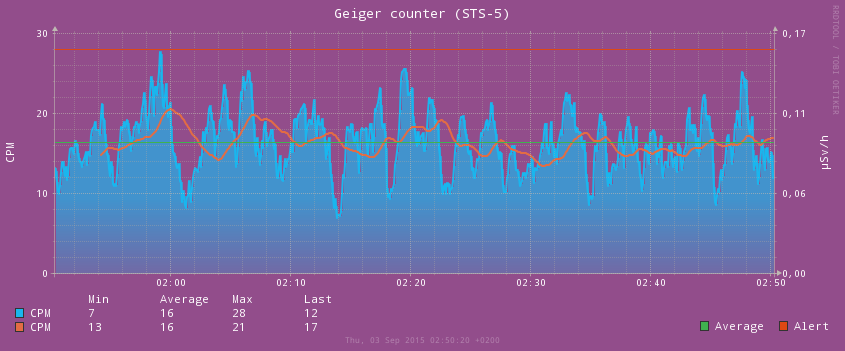

# Geiger counter for Arduino

## Hardware

* 1 × [STS-5 Geiger–Müller tube](http://www.gstube.com/data/4540/)
* 1 × [Radiation Detector Arduino Compatible DIY Kit PCB ver. 3.10](http://www.rhelectronics.net/store/radiation-detector-geiger-counter-diy-kit-second-edition.html)
* 1 × [Arduino UNO R3](https://www.arduino.cc/en/Main/ArduinoBoardUno)
* 1 × 10μF capacitor
* 3 × Jump wire
* 1 × USB type A/B cable

## Software

* [arduino-mk](https://github.com/sudar/Arduino-Makefile) >= 1.5
* [RRDtool](http://oss.oetiker.ch/rrdtool/) >= 1.4.9
* [Bash](https://www.gnu.org/software/bash/)
